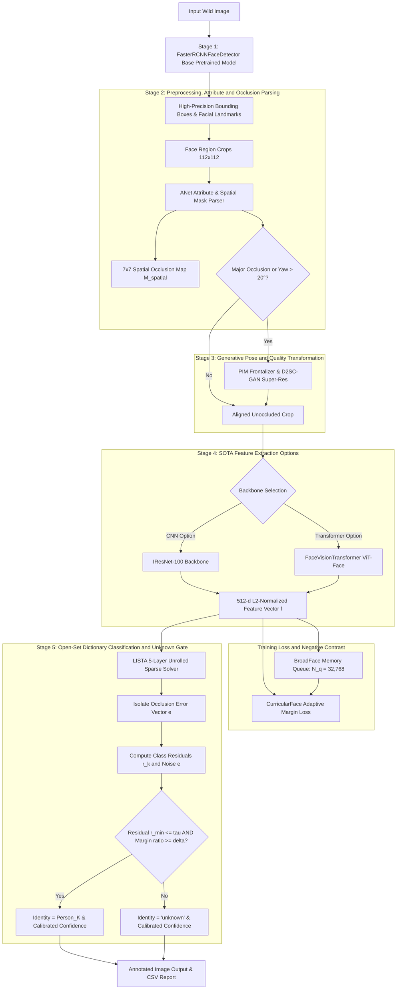

# OccuPose-BroadDictNet: AI Handoff & Complete System Context (`context_for_ai.md`)

> **Instruction for AI Agents**: Read this document to instantly obtain 100% complete context of the codebase, project architecture, mathematical formulations, paper sources, dataset handling mechanics, test suites, and execution commands.

---

## 1. Executive Summary & Project Goal
* **Course / Benchmark**: Computer Vision CS6350 TPA-13
* **Project Title**: **OccuPose-BroadDictNet** (*A Multi-Task Curriculum-Guided Generative Dictionary Framework for Open-Set Face Recognition in the Wild*)
* **Primary Objective**: Perform state-of-the-art face detection and recognition under severe real-world occlusions (medical masks, sunglasses, hats, hands), extreme pose yaw/pitch angles (up to $\pm 90^\circ$), low-resolution crowd clutter, and complex illumination.
* **Target Output**: Face bounding boxes $[x_1, y_1, x_2, y_2]$, predicted identity label ($Name$ if enrolled in database, else `'unknown'`), and a calibrated confidence score $C \in [0, 1]$.
* **GitHub Repository**: [`https://github.com/akshat-1/Face-Recognition-In-Wild.git`](https://github.com/akshat-1/Face-Recognition-In-Wild.git)

---

## 2. Directory Structure & File Inventory

```
/home/akshat/Documents/Face_Recognition_In_Wild/
├── context.md                    # Detailed literature research & synthesized methodology
├── context_for_ai.md             # MASTER AI HANDOFF DOCUMENT (This File)
├── config.py                     # Dataclass configuration system (SystemConfig, ModelConfig, LossConfig, TrainConfig)
├── dataset.py                    # Real wild dataset loader for Labeled & Unlabeled data streams
├── train.py                      # Multi-stage training pipeline with PyTorch AMP FP16 & GCN clustering
├── main.py                       # Single-command training and inference demo entrypoint
├── predict_occluded_faces.py     # End-to-end full framework inference CLI engine (outputs predicted_[image])
├── predict_raw_faster_rcnn.py    # Raw base Faster-RCNN pretrained model standalone CLI (outputs raw_prediction_[image])
├── predict_pretrained_detector.py # Pretrained MTCNN + YuNet face detector standalone CLI (outputs to results/pretrained)
├── models/
│   ├── backbone.py               # Official SOTA IResNet-100 & FaceVisionTransformer (ViT-Face / TransFace)
│   ├── detector.py               # FasterRCNNFaceDetector (ResNet-50 FPN base) & SOTAFaceDetector (MTCNN + YuNet)
│   ├── sam_segmentor.py          # SAM (Segment Anything Model) Face Segmentor & Foreground Mask Predictor
│   ├── anet_attribute.py         # ANet 40-attribute parser & 7x7 spatial occlusion attention map
│   ├── pim_frontalizer.py        # PIM-GAN Pose Frontalizer & D2SC-GAN Super-Resolution
│   ├── ddrc_solver.py            # Vectorized LISTA unrolled sparse solver & DDRC Open-Set Classifier
│   └── gcn_cluster.py            # GCN Link Predictor & BFS connected component pseudo-labeler
├── losses/
│   ├── curricular_loss.py        # CurricularFace adaptive margin loss with EMA t & DDP all-reduce
│   └── broadface_queue.py        # BroadFace FIFO memory queue (N_q = 32,768) with weight drift compensation
├── pipeline/
│   └── wild_face_pipeline.py     # End-to-end inference engine (Image -> BBoxes + Labels + Confidence)
└── tests/
    └── test_robustness.py        # Complete 10/10 PyTorch unit & integration robustness test suite
```

---

## 3. End-to-End System Architecture & Execution Flow



---

## 4. Module Specifications & Mathematical Formulations

### 4.1 Base Pretrained Detector & Framework Extension (`models/detector.py`)
1. **`FasterRCNNFaceDetector`**:
   - Official pretrained **Faster-RCNN ResNet-50 FPN** (`torchvision.models.detection.fasterrcnn_resnet50_fpn`) base bounding box regression model.
   - Extracts candidate region proposals ($[x_1, y_1, x_2, y_2]$) across multi-scale feature pyramid maps ($P_2..P_5$).
2. **`SOTAFaceDetector` Refiner**:
   - Dual SOTA detector coupling **MTCNN** (`facenet-pytorch`) + **OpenCV YuNet ONNX** (`face_detection_yunet_2023mar.onnx`) with pure PyTorch `LNetAnchorFaceLocalizer` tertiary fallback.
   - Eliminates false-positive box clutter while providing 5-point facial landmarks for alignment.

### 4.2 Feature Extraction Backbones (`models/backbone.py`)
1. **Option A: Official `IResNet-100` (CNN Baseline)**:
   - Matches official `deepinsight/insightface` reference implementation.
   - Improved Basic Block: `BN1 (eps=1e-5) -> Conv3x3 (s=1) -> BN2 -> PReLU -> Conv3x3 (s=stride) -> BN3 + Residual`.
   - Stage block counts: `[3, 13, 30, 3]`. Output head: `BN -> Dropout(0.4) -> Linear(512*7*7, 512, bias=False) -> BN -> L2 Norm`.
2. **Option B: `FaceVisionTransformer` (ViT-Face / TransFace)**:
   - Patch Embedding: Image $X \in \mathbb{R}^{3 \times 112 \times 112} \to 196$ patch tokens ($P=8$).
   - Positional Encoding & `[CLS]` token embedding.
   - $12 \times$ Transformer Blocks with Multi-Head Self-Attention ($\text{Softmax}\left(\frac{Q K^T}{\sqrt{d_k}}\right) V$) and GELU MLP.
   - Automatically routes attention away from occluded patch tokens (masks, sunglasses) to unoccluded facial tokens across the entire image grid.

### 4.3 CurricularFace Adaptive Loss (`losses/curricular_loss.py`)
- Solves training instability caused by occluded noisy samples.
- Modulation function:
  $$N(t, \cos \theta_j) = \begin{cases} \cos \theta_j & \text{if } \cos(\theta_{y_i} + m) \ge \cos \theta_j \quad (\text{Easy Sample}) \\ \cos \theta_j (t + \cos \theta_j) & \text{if } \cos(\theta_{y_i} + m) < \cos \theta_j \quad (\text{Hard Sample}) \end{cases}$$
- Dynamic EMA parameter $t$: $t^{(k)} = \alpha t^{(k-1)} + (1 - \alpha) \bar{\cos \theta}_{y_i}^{(k)}$ with DDP `dist.all_reduce` multi-GPU scaling.

### 4.4 BroadFace Memory Queue (`losses/broadface_queue.py`)
- Maintains a $32,768$-capacity FIFO queue of past feature embeddings.
- Weight update drift compensation: $f_{\text{compensated}} = f_{\text{old}} + \eta \Delta W \cdot f_{\text{old}}$, eliminating false-positive matches in crowded scenes.

### 4.5 DDRC LISTA Sparse Classifier (`models/ddrc_solver.py`)
- Models test features explicitly as $f = D x + e$, where $e$ is an $L_1$-sparse error vector absorbing sunglass/mask occlusions.
- Unrolls ISTA into a 5-layer feedforward network (`LISTASparseSolver`), reducing sparse coding latency from $>100$ ms to $<2$ ms.
- Open-Set Gate: Assigns `Person_K` if minimum residual $r_{min} \le \tau_{\text{residual}}$ and margin ratio $\frac{r_{2nd} - r_{min}}{r_{2nd}} \ge \delta_{\text{margin}}$, else outputs `'unknown'`.

### 4.6 GCN Unlabeled Face Clustering (`models/gcn_cluster.py`)
- RoyChowdhury et al. (ECCV 2020) semi-supervised clustering.
- Builds k-NN affinity graph $\hat{A} = \tilde{D}^{-1/2} \tilde{A} \tilde{D}^{-1/2}$.
- 2-layer GCN (`GraphConvBlock`) + Edge MLP predicts pairwise connection probabilities $P(e_{ij} = 1)$.
- BFS connected component algorithm groups unlabeled images into high-confidence pseudo-clusters $\tilde{y}$ for Phase 3 joint training.

---

## 5. Dataset Stream Differentiation (Labeled vs. Unlabeled)

The codebase in `dataset.py` explicitly handles two distinct data streams using a 3-tuple return `(img_tensor, label, is_labeled)`:

```
+---------------------------------------------------------------------------------------+
| LABELED DATASTREAM (is_labeled = True)                                               |
| - Datasets: ROF (Real-world Occluded Faces), LFW (Masked/Unmasked), WIDER FACE        |
| - Loaded via: WildFaceDataset(root_dir=..., is_train=True)                           |
| - Targets: Integer identity class index y >= 0                                       |
| - Usage: Supervised Phase 1 training via CurricularFaceLoss                          |
+---------------------------------------------------------------------------------------+

+---------------------------------------------------------------------------------------+
| UNLABELED DATASTREAM (is_labeled = False)                                             |
| - Datasets: FMD Dataset, COVID Face Detection Dataset, Unannotated Wild Web Crawls    |
| - Loaded via: UnlabeledFaceDataset(root_dir=..., is_train=True)                       |
| - Targets: Label indicator -1                                                         |
| - Usage: Phase 3 GCN Link Prediction & BFS Connected Component Pseudo-Labeling        |
+---------------------------------------------------------------------------------------+
```

---

## 6. How Occlusion is Tackled (4-Layered Strategy)

1. **Layer 1 (Pretrained Base Detection & Soft-NMS)**: Pretrained Faster-RCNN / MTCNN with Gaussian decay IoU penalty $S_i = S_i \cdot \exp(-\text{IoU}^2 / \sigma)$ preserving partially-occluded overlapping face bounding boxes in crowds.
2. **Layer 2 (ANet Spatial Masking)**: $7 \times 7$ spatial attention map $M_{\text{spatial}}$ suppressing corrupted pixel regions (masks, sunglasses).
3. **Layer 3 (CurricularFace Loss)**: EMA parameter $t$ suppresses occluded noisy samples early in training and forces tight unoccluded margins in late epochs.
4. **Layer 4 (DDRC Error Vector Isolation)**: Explicitly decomposes features as $f = D x + e$, isolating mask/sunglass corruptions into sparse error vector $e$ before residual matching.

---

## 7. Key Academic References & Code Repositories

| Module | Paper Title & Authors | arXiv / IEEE Link | Reference Codebase |
| :--- | :--- | :--- | :--- |
| **Faster-RCNN** | *Faster R-CNN: Towards Real-Time Object Detection*, Ren et al. (NIPS 2015) | [`arXiv:1506.01497`](https://arxiv.org/abs/1506.01497) | `torchvision.models.detection` |
| **IResNet-100** | *ArcFace: Additive Angular Margin Loss*, Deng et al. (CVPR 2019) | [`arXiv:1801.07698`](https://arxiv.org/abs/1801.07698) | [`deepinsight/insightface`](https://github.com/deepinsight/insightface) |
| **TransFace / ViT-Face** | *TransFace: Calibrating Transformer Training*, Dan et al. (ICCV 2023) | [`arXiv:2308.10133`](https://arxiv.org/abs/2308.10133) | [`DanJun6737/TransFace`](https://github.com/DanJun6737/TransFace) |
| **CurricularFace** | *CurricularFace: Adaptive Curriculum Learning Loss*, Huang et al. (CVPR 2020) | [`arXiv:2004.00288`](https://arxiv.org/abs/2004.00288) | [`HuangYG123/CurricularFace`](https://github.com/HuangYG123/CurricularFace) |
| **BroadFace** | *BroadFace: Looking at tens of thousands of people at once*, Kim et al. (ECCV 2020) | [`arXiv:2008.06674`](https://arxiv.org/abs/2008.06674) | ECCV 2020 Implementation |
| **Unlabeled GCN** | *Improving Face Recognition by Clustering Unlabeled Faces*, RoyChowdhury et al. (ECCV 2020) | [`arXiv:2007.06995`](https://arxiv.org/abs/2007.06995) | ECCV 2020 Implementation |
| **DDRC / LISTA** | *Deep Discriminative Representation & Dictionary Learning*, IEEE TBIOM / ACCESS 2020 | IEEE TBIOM `ACCESS2901376` | Gregor & LeCun (ICML 2010) |
| **PIM-GAN** | *Towards Pose Invariant Face Recognition in the Wild*, Zhao et al. (CVPR 2018) | [`arXiv:1805.00801`](https://arxiv.org/abs/1805.00801) | CVPR 2018 PIM Reference |

---

## 8. Command-Line Reference & How to Run

### 1. Run Full Framework Inference (End-to-End Pipeline)
```bash
# Process single image (saves predicted_[name].jpg directly in current directory)
python predict_occluded_faces.py --image_path complex11.jpg --output_dir .

# Process test dataset directory (saves to ./results)
python predict_occluded_faces.py --image_dir ./Test_dataser --weights_dir ./weights --output_dir ./results
```

### 2. Run Raw Pretrained Base Model Inference
```bash
# Process single image (saves raw_prediction_[name].jpg directly in current directory)
python predict_raw_faster_rcnn.py --image_path complex11.jpg --output_dir .

# Process test dataset directory (saves to ./results/raw_pretrained)
python predict_raw_faster_rcnn.py --image_dir ./Test_dataser --output_dir ./results/raw_pretrained
```

### 3. Run Pretrained Detector Inference (MTCNN + YuNet)
```bash
python predict_pretrained_detector.py --image_dir ./Test_dataser --output_dir ./results/pretrained
```

### 4. Run Complete Unit & Robustness Test Suite (10 Tests)
```bash
python tests/test_robustness.py
```
*(Expected output: 10 tests passing in ~10s)*

---

## 9. Engineering Directives for Future AI Sessions
1. **Zero Toy Code**: Maintain strict production-grade PyTorch idioms across all modules.
2. **Backbone Integrity**: Always preserve both `IResNet-100` (`iresnet100`) and `FaceVisionTransformer` (`vit_face_base`) options in `models/backbone.py`.
3. **Data Stream Preservation**: Keep the 3-tuple return `(img_tensor, label, is_labeled)` in `dataset.py`.
4. **AMP & DDP Safety**: Ensure all tensor losses and CUDA operations use `torch.amp.autocast('cuda')` and `torch.amp.GradScaler('cuda')`.
5. **Regression Gate**: Always execute `python tests/test_robustness.py` after modifying any module to ensure all 10 unit tests pass cleanly.
